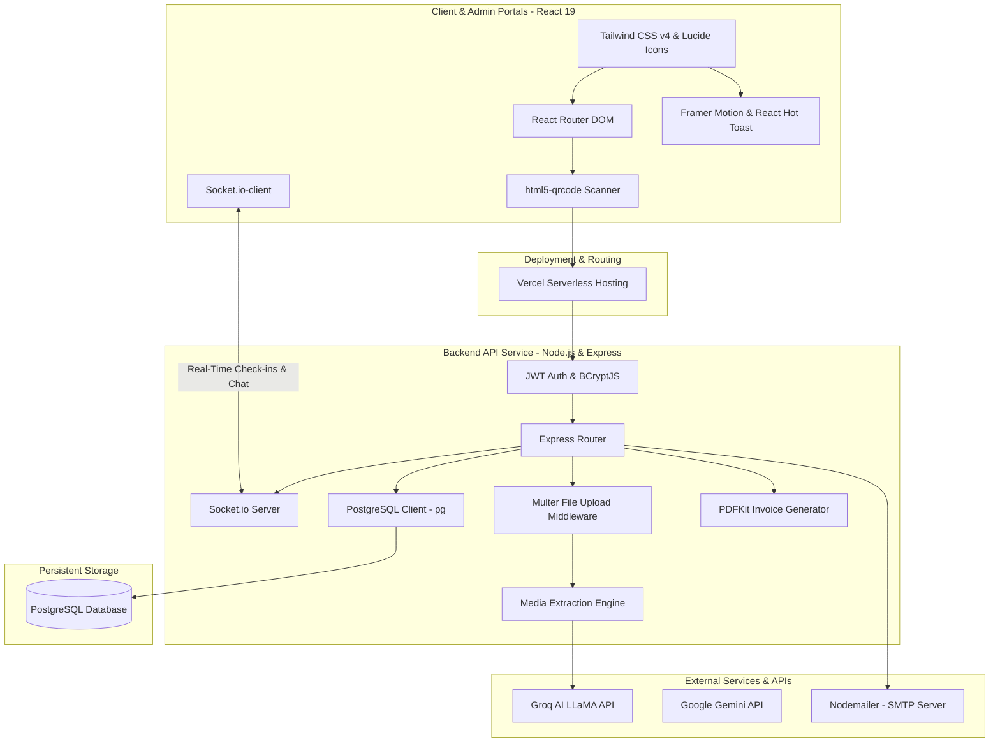

# System Architecture & Feature Overview: Narrow Fitness

**A Full-Stack AI-Powered and QR-Integrated Gym Management Platform**

---

## 1. Executive Summary

**Narrow Fitness** is a comprehensive, full-stack gym management and virtual personal coaching platform. By combining unified administrative dashboards (handling trainer schedules, class bookings, and automated billing) with real-time WebSocket check-ins and an advanced AI-guided fitness coach, Narrow Fitness streamlines gym operations while elevating member engagement. 

The virtual AI coach utilizes Large Language Models (LLMs) alongside OCR document parsing, vision recognition, and audio processing to ingest multi-format user data and output tailored workout schedules, dietary guidance, and wellness insights.

---

## 2. System Architecture Design

The platform employs a modular, decoupled full-stack architecture built for high concurrency, real-time feedback, and secure role-based authorization.

### Component Details

* **Frontend Portal (React 19 & TypeScript)**: Structured as a responsive single-page application (SPA). It uses **React Router DOM** for client-side navigation, **Framer Motion** for micro-interactions, **Tailwind CSS v4** for clean responsive styling, and **html5-qrcode** to run browser-based camera scanning for check-ins.
* **Backend API (Node.js & Express v5)**: Manages authentication, routes user payloads, controls business models, triggers background notifications, and runs file buffering.
* **Real-time Engine (Socket.io)**: Handles instant event streams. When a member scans their QR code at a desk or via their dashboard, Socket.io broadcasts the check-in event to the admin terminal in under 100ms.
* **Media Extraction Engine**: Integrates **mammoth** (for Word document text extraction) and **pdf-parse** (for extracting text from PDFs) to ingest offline plans, alongside Groq APIs to parse audio and visual files.
* **Invoice & Document Generator**: Leverages **PDFKit** to dynamically construct and stream downloadable PDF invoices and receipts directly to client endpoints when pricing packages are active.

---

## 3. Database Schema

The persistent layer is managed via **PostgreSQL** to handle multi-role tables, member profiles, check-in records, payment histories, and AI usage metrics:

| Table / Entity | Primary Fields | Relationships | Purpose |
| :--- | :--- | :--- | :--- |
| **users** | `id`, `name`, `email`, `password`, `role` (ADMIN/MEMBER/TRAINER) | One-to-Many with checkins, chat sessions, payments | Stores core authentication details and user roles |
| **memberprofiles** | `id`, `userid`, `gender`, `dob`, `current_weight`, `height`, `target_weight`, `primary_goal`, `has_injuries`, `injury_details` | Many-to-One with user, pricing | Contains onboarding metrics, health histories, and chosen membership packages |
| **pricing** | `id`, `name`, `price`, `duration` | One-to-Many with memberprofiles | Outlines active pricing subscription tiers (Basic, Pro, etc.) |
| **memberships** | `id`, `userid`, `status` (active/blocked), `start_date`, `end_date` | Many-to-One with user | Tracks billing status and locks blocked users out of AI/check-in services |
| **attendance** | `id`, `userid`, `check_in`, `check_out`, `status` | Many-to-One with user | Tracks check-in timestamps, check-out events, and logs total daily hours |
| **chat_sessions** | `id`, `userid`, `title`, `created_at` | Many-to-One with user, One-to-Many with chat_history | Manages individual coach conversation sessions |
| **chat_history** | `id`, `session_id`, `role` (user/model), `message`, `input_type` (text/voice/file), `file_name` | Many-to-One with chat_sessions | Saves persistent message transcripts between member and the AI model |
| **ai_usage** | `userid`, `daily_count`, `last_message_at` | Many-to-One with user | Implements API guardrails, monitoring daily usage counts relative to tiers |
| **payments** | `id`, `userid`, `amount_paid`, `package_name`, `payment_method`, `payhere_payment_id`, `status` | Many-to-One with user | Stores invoices and tracks successful PayHere transactional tokens |

---

## 4. Key AI Capabilities

### A. Contextual Accountability Chat
Every conversational message is combined with a dynamic client contextual prompt (including age, weight, target goals, injuries, and allergies fetched from `memberprofiles`). This payload is sent to the **Groq LLaMA** model (`llama-3.1-8b-instant` or `llama-3.3-70b-versatile` depending on content length). The model replies with highly targeted fitness recommendations that steer clear of the member's specific medical restrictions.

### B. Speech-to-Text Conversational Voice Notes
Members can record verbal coaching questions directly on the screen. The backend captures the audio payload via **Multer** and dispatches it to **Groq Whisper Large v3** with targeted prompts to handle specialized fitness phrasing and mixed phonetic translations (English/Sinhala), outputting clean transcription text.

### C. Multimodal Document & Workout Analysis
The extraction pipeline allows members to easily digitize paper logs:
1. **Vision Extractor (Groq Vision)**: Ingests base64 image data of workout cards or restaurant food charts, extracting exercises and nutrition facts into clean markdown tables.
2. **Text Document Parsers**: Processes PDF and Word documents via direct buffer parsing (`pdf-parse` and `mammoth`), summarizing long coach reports and adding the text directly to the AI coach's context window.

---

## 5. Deployment & Production Setup

* **Frontend**: Compiled and optimized via Vite; hosted on **Vercel** serverless configurations.
* **Backend**: Structured using Node.js TypeScript and deployed inside Docker containers on scalable cloud hosts (Render/AWS/Railway).
* **Database**: Runs on a managed PostgreSQL instance with connection pooling enabled.
* **Local Storage & Assets**: Uploaded files and receipts are cataloged locally inside dynamic `/uploads` subfolders, with ready hooks for S3-compatible cloud object storage.
